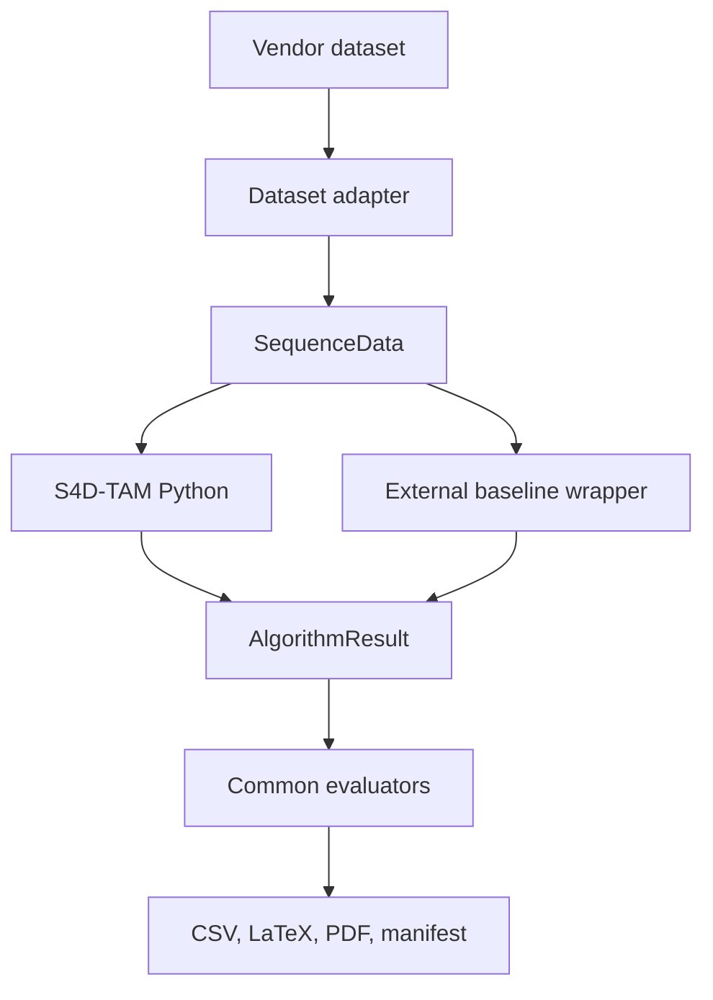

# Architecture

## Design rule

Every dataset is converted once into `SequenceData`. Every algorithm returns an
`AlgorithmResult`. All metrics consume only these two contracts. Consequently, no baseline
receives a different evaluator and no method-specific post-processing can alter the primary
comparison unnoticed.

## Proposed implementation modules

- `token.py`: persistent 4-D token state: position, covariance, velocity, semantics,
  observation history, uncertainty, and risk.
- `memory.py`: association, probabilistic update, temporal state, and token lifecycle.
- `pipeline.py`: reference execution contract. Planned modules for learned encoders,
  attention, topology, reference-map alignment, forecasting, and risk-aware planning are
  listed in the roadmap.

The reference implementation intentionally favors traceability over speed. Optimized
PyTorch/CUDA kernels may be added behind the same adapter after numerical parity tests.

## External baseline contract

For sequence `<dataset>/<sequence>.npz`, a baseline artifact contains:

- required: `timestamps [N]`, `estimated_positions [N,3]`;
- optional: `estimated_quaternions [N,4]`, `semantic_pred [N,...]`, `latency_ms [N]`;
- scalar telemetry: keys prefixed with `resource_`, for example `resource_peak_rss_mb`.

Wrappers must record the upstream repository commit, configuration, calibration, hardware,
container digest, warm-up policy, and whether loop closure is enabled.
