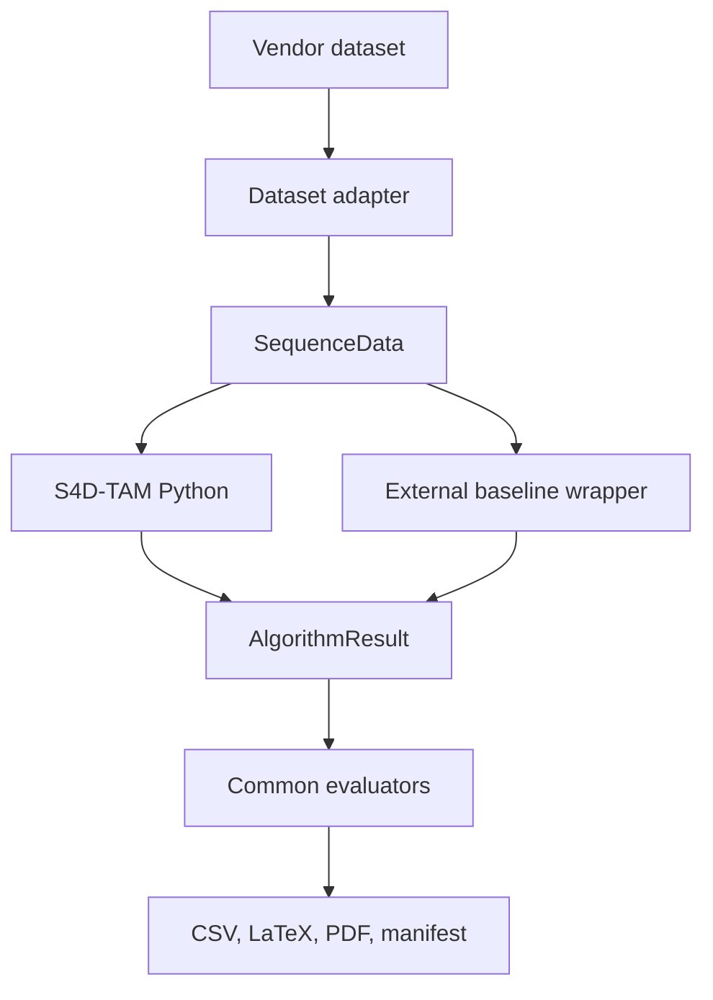

# Architecture

## Design rule

Every dataset is converted once into `SequenceData`. Every algorithm returns an
`AlgorithmResult`. All metrics consume only these two contracts. Consequently, no baseline
receives a different evaluator and no method-specific post-processing can alter the primary
comparison unnoticed.

## Proposed implementation modules

- `token.py`: persistent 4-D token state: position, covariance, velocity, semantics,
  observation history, uncertainty, and risk.
- `memory.py`: association, probabilistic update, temporal state, and token lifecycle.
- `pipeline.py`: reference execution contract. Planned modules for learned encoders,
  attention, topology, reference-map alignment, forecasting, and risk-aware planning are
  listed in the roadmap.

The reference implementation intentionally favors traceability over speed. Optimized
PyTorch/CUDA kernels may be added behind the same adapter after numerical parity tests.

## External baseline contract

For sequence `<dataset>/<sequence>.npz`, a baseline artifact uses
`s4dtam-algorithm-result-npz/v1` and contains:

- required: strictly increasing seconds `timestamps [N]`, `estimated_positions [N,3]`,
  xyzw `estimated_quaternions [N,4]`, and non-negative `latency_ms [N]`;
- required scalar telemetry: `resource_peak_rss_mb` and `resource_cpu_time_s`;
- optional additional scalar telemetry uses the `resource_` prefix.

The external parser rejects a missing field, non-finite value, timestamp collision, or array
with an incompatible shape before any evaluator is called. Quaternions are normalized at the
contract boundary. The four wrapper definitions pin source and container identities and state
their ROS topic mapping and calibration requirements; their YAML files additionally fix the
hardware policy, warm-up, and loop-closure parameters.

Wrappers must record the upstream repository commit, configuration, calibration, hardware,
container digest, warm-up policy, and whether loop closure is enabled.
The run manifest stores those values for every successful external execution as well as the
host machine, processor, Python version, and platform.
