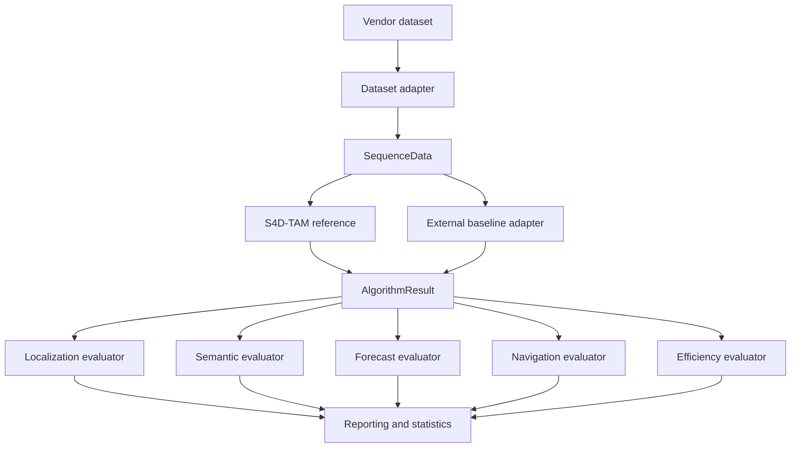
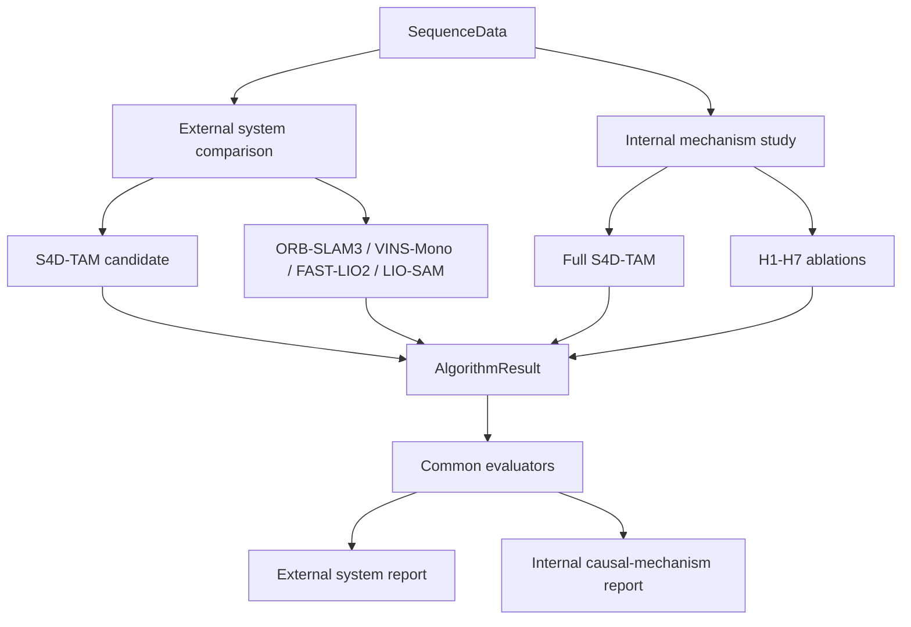
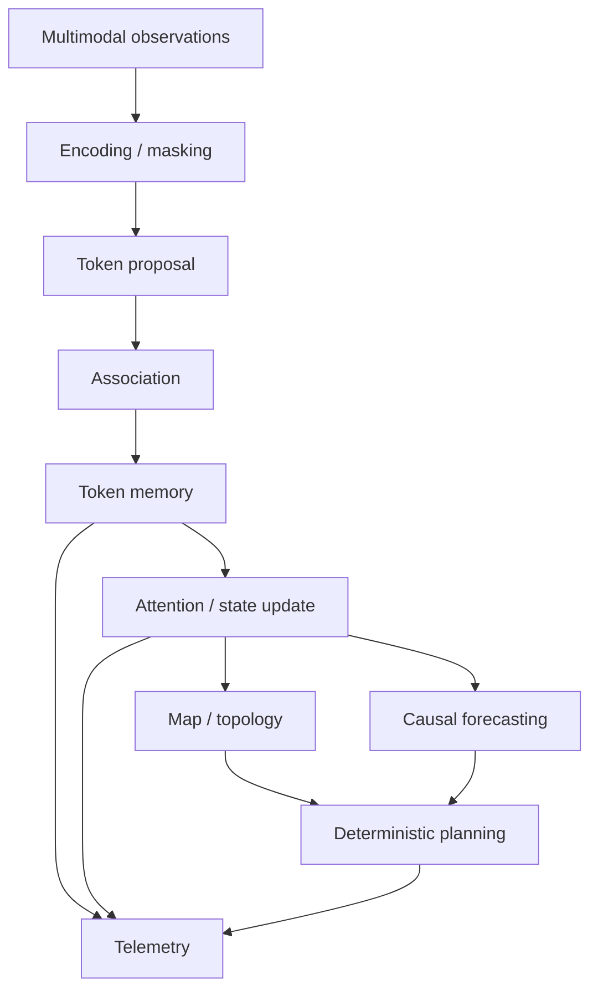

# Architecture

## Core design rule

Every dataset is converted to the same `SequenceData` contract. Every algorithm returns the same `AlgorithmResult` contract. Metric evaluators consume only these normalized objects.

This is the benchmark's main comparability guarantee: a baseline cannot receive a different evaluator or hidden method-specific post-processing without changing an explicit contract.

## Benchmark layers

| Layer | Responsibility |
| --- | --- |
| Configuration | version-controlled experiment, dataset and algorithm settings |
| Dataset adapters | source-specific conversion to normalized sequence data |
| Algorithm adapters | S4D-TAM reference, simple internal baselines and external result ingestion |
| Contracts | shapes, timestamps, poses, observations, predictions and telemetry |
| Evaluation | common numerical metrics independent of algorithm implementation |
| Reporting | machine-readable outputs, statistics, plots, tables and provenance |
| Reproduction | release integrity, package validation and immutable research artifacts |

## Two-level evaluation architecture

The common evaluator boundary is shared, but the scientific comparison is deliberately split in two.

`comparison_level: external` answers whether the complete S4D-TAM system is competitive with independent systems. `comparison_level: internal` answers which S4D-TAM mechanisms contribute to the full model. The configuration validator rejects matrices that mix those roles. See [Two-level comparison protocol](comparison-protocol.md).

## Current S4D-TAM reference structure

The reference implementation has progressed beyond the original token-lifecycle skeleton. The source tree currently contains dedicated modules for:

- `token.py`: persistent 4D token state;
- `proposal.py`: candidate token proposal;
- `association.py`: feature, radial and fallback association paths;
- `memory.py`: lifecycle rules, uncertainty/noise handling, budgets and token memory;
- `encoders/`: modality-oriented encoder interfaces and masked fusion support;
- `attention.py`: hierarchical attention-related processing;
- `calibration.py`: calibration parameter handling and fitting utilities;
- `reference_map.py`: versioned reference-map representation and coordinate handling;
- `topology.py`: topological graph and verified matching support;
- `forecasting.py`: causal probabilistic occupancy and motion forecasting;
- `planner.py`: deterministic predictive-map trajectory planning with explicit risk, energy, time, goal-progress and information-value costs;
- `telemetry.py`: structured event logging;
- `pipeline.py`: integration of the reference execution path.

!!! note "Implementation maturity"
    These modules are executable research components. They are not equivalent to a fully trained, optimized and experimentally validated final S4D-TAM model. See [Project status](project-status.md) and [S4D-TAM module catalog](modules.md).

## Reference pipeline

The Python implementation favors traceability and numerical inspection over throughput. In particular, the current deterministic planner is advantageous for initial confirmatory studies because candidate evaluation can be replayed exactly. A future MPPI backend may improve performance for richer dynamics, but should be introduced behind the same planner contract and compared against the deterministic reference before becoming the default.

## Target research extensions

Several mechanisms in the paper describe the target architecture rather than already completed production-quality modules. The explicit planned boundaries are:

- learned hierarchical multimodal encoders and spatiotemporal attention;
- a probabilistic scene-state backend supporting DBN/particle or equivalent multimodal inference;
- an optional MPPI planning backend;
- adaptive octree/LOD world-model storage;
- a closed-loop active-perception controller;
- a safety-aware real-time scheduler with queue/deadline monitoring and graceful degradation.

They are tracked in [S4D-TAM module catalog](modules.md) and the [Roadmap](roadmap.md). Empty placeholder modules are intentionally avoided until an executable contract and tests can be provided.

## Auditability

Token lifecycle, association, attention-related decisions and pruning events can be captured in a versioned per-sequence JSONL audit trail. See [Token event logging](token-event-logging.md) for schema and durability details.

A run manifest additionally records environment and provenance information needed to distinguish algorithm effects from experimental drift.

## External baseline contract

For sequence `<dataset>/<sequence>.npz`, an external baseline artifact uses `s4dtam-algorithm-result-npz/v1`.

Required arrays include:

- `timestamps [N]`, strictly increasing and expressed in seconds;
- `estimated_positions [N,3]`;
- `estimated_quaternions [N,4]` in xyzw order;
- `latency_ms [N]`, non-negative.

Required scalar telemetry includes `resource_peak_rss_mb` and `resource_cpu_time_s`. Additional scalar telemetry uses the `resource_` prefix.

The parser rejects missing fields, incompatible shapes, non-finite values and timestamp collisions before evaluation. Quaternions are normalized at the contract boundary.

Evaluation uses a strict one-to-one time synchronization policy. An algorithm result must
contain exactly as many samples as its input sequence, in the same order, and every result
timestamp must match the corresponding dataset timestamp with an absolute tolerance of
`1e-6` seconds (and zero relative tolerance). The default evaluator rejects mismatches
before computing any metric; it does not interpolate, resample, or otherwise align samples.
Any future interpolation behavior must be introduced as a separate, explicitly documented
evaluation mode rather than changing this default contract.

## Baseline provenance

External wrappers should record:

- upstream repository and exact commit;
- configuration and calibration identity;
- container or environment identity;
- hardware policy;
- warm-up policy;
- loop-closure policy where applicable;
- ROS topic mapping for ROS-based systems.

This metadata is stored with successful runs so that numerical results remain traceable to the exact baseline configuration.

## Why the contract boundary matters

The normalized boundary decouples evaluation from implementation language and middleware. S4D-TAM can remain Python-native while ORB-SLAM3, VINS-Mono, FAST-LIO2 or LIO-SAM can execute in C++/ROS environments. Comparison begins only after both paths produce the same result schema.

For the file-level artifact schema, see [Artifact specification](artifact-specification.md).
