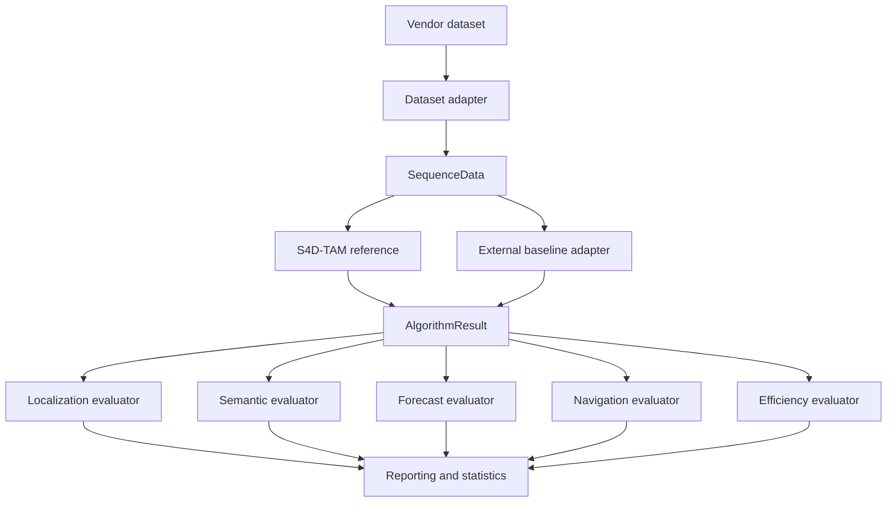
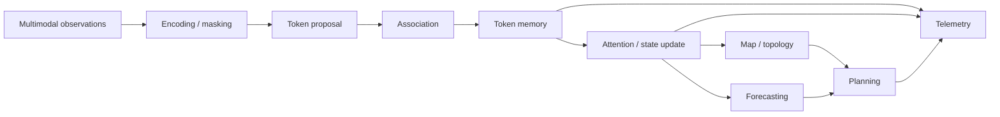

# Architecture

## Core design rule

Every dataset is converted to the same `SequenceData` contract. Every algorithm returns the same `AlgorithmResult` contract. Metric evaluators consume only these normalized objects.

This is the benchmark's main comparability guarantee: a baseline cannot receive a different evaluator or hidden method-specific post-processing without changing an explicit contract.

## Benchmark layers

| Layer | Responsibility |
| --- | --- |
| Configuration | version-controlled experiment, dataset and algorithm settings |
| Dataset adapters | source-specific conversion to normalized sequence data |
| Algorithm adapters | S4D-TAM reference, simple internal baselines and external result ingestion |
| Contracts | shapes, timestamps, poses, observations, predictions and telemetry |
| Evaluation | common numerical metrics independent of algorithm implementation |
| Reporting | machine-readable outputs, statistics, plots, tables and provenance |
| Reproduction | release integrity, package validation and immutable research artifacts |

## Current S4D-TAM reference structure

The reference implementation has progressed beyond the original token-lifecycle skeleton. The source tree currently contains dedicated modules for:

- `token.py`: persistent 4D token state;
- `proposal.py`: candidate token proposal;
- `association.py`: feature, radial and fallback association paths;
- `memory.py`: lifecycle rules, uncertainty/noise handling, budgets and token memory;
- `encoders/`: modality-oriented encoder interfaces and masked fusion support;
- `attention.py`: hierarchical attention-related processing;
- `calibration.py`: calibration parameter handling and fitting utilities;
- `reference_map.py`: versioned reference-map representation and coordinate handling;
- `topology.py`: topological graph and verified matching support;
- `forecasting.py`: causal forecasting utilities;
- `planner.py`: predictive-map and trajectory-planning structures;
- `telemetry.py`: structured event logging;
- `pipeline.py`: integration of the reference execution path.

!!! note "Implementation maturity"
    These modules are executable research components. They are not equivalent to a fully trained, optimized and experimentally validated final S4D-TAM model. See [Project status](project-status.md).

## Reference pipeline

The Python implementation favors traceability and numerical inspection over throughput. Optimized PyTorch/CUDA implementations can be introduced behind the same algorithm contract once numerical parity is demonstrated.

## Auditability

Token lifecycle, association, attention-related decisions and pruning events can be captured in a versioned per-sequence JSONL audit trail. See [Token event logging](token-event-logging.md) for schema and durability details.

A run manifest additionally records environment and provenance information needed to distinguish algorithm effects from experimental drift.

## External baseline contract

For sequence `<dataset>/<sequence>.npz`, an external baseline artifact uses `s4dtam-algorithm-result-npz/v1`.

Required arrays include:

- `timestamps [N]`, strictly increasing and expressed in seconds;
- `estimated_positions [N,3]`;
- `estimated_quaternions [N,4]` in xyzw order;
- `latency_ms [N]`, non-negative.

Required scalar telemetry includes `resource_peak_rss_mb` and `resource_cpu_time_s`. Additional scalar telemetry uses the `resource_` prefix.

The parser rejects missing fields, incompatible shapes, non-finite values and timestamp collisions before evaluation. Quaternions are normalized at the contract boundary.

## Baseline provenance

External wrappers should record:

- upstream repository and exact commit;
- configuration and calibration identity;
- container or environment identity;
- hardware policy;
- warm-up policy;
- loop-closure policy where applicable;
- ROS topic mapping for ROS-based systems.

This metadata is stored with successful runs so that numerical results remain traceable to the exact baseline configuration.

## Why the contract boundary matters

The normalized boundary decouples evaluation from implementation language and middleware. S4D-TAM can remain Python-native while ORB-SLAM3, VINS-Mono, FAST-LIO2 or LIO-SAM can execute in C++/ROS environments. Comparison begins only after both paths produce the same result schema.

For the file-level artifact schema, see [Artifact specification](artifact-specification.md).
