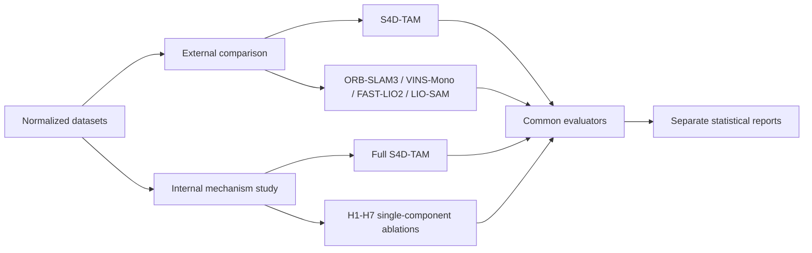

# Two-level comparison protocol

S4D-TAM uses two deliberately separate evaluation levels. They answer different scientific questions and must not be merged into one comparison matrix.

## Level 1: external system comparison

**Question:** Is S4D-TAM competitive with established independent navigation and SLAM systems under the same datasets, sensor availability, hardware policy and evaluator contracts?

The canonical configuration is `configs/experiments/offline_benchmark.yaml` with `comparison_level: external`.

The mandatory primary baseline set is:

- ORB-SLAM3;
- VINS-Mono;
- FAST-LIO2;
- LIO-SAM.

S4D-TAM is the single candidate. The baselines are independent implementations and enter the benchmark only through the normalized `AlgorithmResult` artifact contract. Additional systems may be added when they satisfy all of the following: compatible sensing assumptions, reproducible upstream revision, legally redistributable configuration, fixed calibration and loop-closure policy, and an auditable conversion to the common result schema.

External comparison is a **system-level competitiveness study**. It does not identify which S4D-TAM mechanism caused a performance difference.

## Level 2: internal mechanism study

**Question:** Which components of S4D-TAM contribute causally to localization, prediction, navigation safety and computational efficiency?

The canonical configuration is `configs/experiments/ablation.yaml` with `comparison_level: internal`.

Every H1-H7 contrast compares the same full S4D-TAM model with exactly one disabled mechanism:

| Hypothesis | Variant | Disabled mechanism | Primary endpoint |
| --- | --- | --- | --- |
| H1 | `H1_no_semantics` | semantics | mission success |
| H2 | `H2_no_temporal_state` | temporal state | forecast IoU at 1 s |
| H3 | `H3_no_calibrated_uncertainty` | calibrated uncertainty | collisions/km |
| H4 | `H4_no_topology` | topology | mission success |
| H5 | `H5_no_reference_map` | reference-map support | ATE RMSE |
| H6 | `H6_no_risk_prediction` | risk prediction | collisions/km |
| H7 | `H7_no_token_lifecycle` | token lifecycle | latency p95 + mission-success non-inferiority |

The datasets, seeds, preprocessing, optimization budget and all unlisted model settings remain frozen within each pair. External algorithms never appear in this matrix.

## Why separation is mandatory

Combining independent baseline algorithms and component ablations in one inferential family would mix two estimands:

1. the difference between complete navigation systems;
2. the effect of removing one mechanism from S4D-TAM.

Those quantities have different controls, assumptions and interpretations. The repository therefore validates them with different configuration contracts through `s4dtam-bench validate-comparison`.

## Shared evaluator boundary

Both levels ultimately use the same normalized dataset and metric contracts where applicable. This preserves numerical comparability while keeping the scientific questions separate.

## Execution gates

External comparison should not be treated as publication-ready until dataset conversion and every baseline wrapper are reproduced from pinned upstream revisions. Internal comparison should not begin until the learned S4D-TAM artifacts for `full` and H1-H7 are frozen and the preregistration integrity checks pass.
