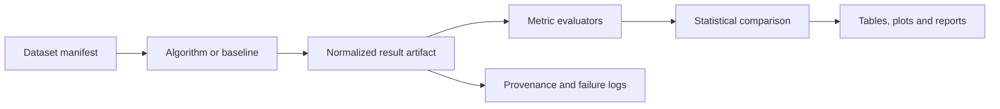

# S4D-TAM Benchmark

**Semantic 4D Token Attention Map for autonomous UAV navigation in GNSS-degraded environments.**

S4D-TAM Benchmark is a reproducible Python benchmark and transparent reference implementation accompanying the S4D-TAM research methodology. The repository provides a common evaluation contract for visual, visual-inertial, LiDAR-inertial and S4D-TAM-based navigation systems.

!!! warning "Research software"
    The current `S4DTAMReference` is an executable CPU reference of the token lifecycle and evaluation interfaces. It is not yet the trained hierarchical transformer described in the paper and is not flight-certified.

## What the benchmark provides

The evaluation pipeline is designed to produce auditable, machine-readable results rather than isolated headline metrics. A benchmark run can generate:

- normalized trajectory, semantic, forecasting, navigation and efficiency metrics;
- paired statistical comparisons and confidence intervals;
- LaTeX-ready tables and vector plots;
- experiment manifests and provenance records;
- explicit failure logs;
- explicit records of metrics that cannot be computed for a given dataset.

## Quick start

```bash
python -m venv .venv
source .venv/bin/activate  # Windows: .venv\\Scripts\\activate
python -m pip install -e ".[dev]"
s4dtam-bench doctor
s4dtam-bench run configs/experiments/smoke.yaml
```

The smoke run is synthetic and validates the software stack only. Scientific experiments should use registered dataset versions, immutable sequence lists, repeated seeds and the protocol defined in [Reproducibility](reproducibility.md).

## Evaluation scope

| Domain | Representative outputs |
| --- | --- |
| Localization | ATE, RPE, final drift, drift percentage |
| Semantics | mIoU, class IoU, macro F1, accuracy, temporal label-flip rate |
| Forecasting | occupancy IoU, precision, recall, F1, Brier score, NLL, ECE, flow EPE |
| Navigation | mission success, collisions, near misses, clearance, path efficiency, energy |
| Efficiency | latency percentiles, FPS, peak memory, map size, token count, energy |
| Statistical inference | paired bootstrap confidence intervals, effect sizes, multiplicity correction |

Metric availability depends on ground-truth annotations. Missing values are not silently imputed. See [Metrics](metrics.md).

## Supported data sources

The benchmark targets public autonomous-navigation datasets including TartanAir, Blackbird UAV Dataset, MARSIM and AeroVerse through the repository's dataset adapters and manifest system. Internal datasets can also be evaluated after conversion to the normalized data contract.

See [Datasets](datasets.md) for dataset-specific requirements, licensing checks and conversion rules.

## Evaluation workflow



## Documentation map

Use the top navigation to move from system design to experimental validation:

1. **Benchmark** describes architecture, methodology, metrics, datasets and artifact contracts.
2. **Evaluation protocols** defines reproducible SIL, HIL and real-flight validation.
3. **Reproduction and compliance** supports independent verification and reporting.
4. **Development** tracks roadmap, contribution rules, releases and citation metadata.

## Citation

If you use this benchmark in scientific work, follow the metadata described on the [Citation](citation.md) page and the repository `CITATION.cff` file.
