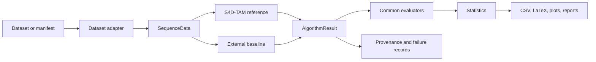
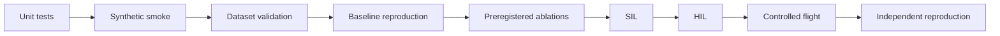

# S4D-TAM Benchmark

**Reproducible evaluation infrastructure and transparent reference implementation for Semantic 4D Token Attention Map UAV navigation in GNSS-degraded environments.**

The project provides one auditable evaluation path for S4D-TAM and external navigation baselines, from dataset registration to publication-ready statistics and artifacts.

[Get started](getting-started.md){ .md-button .md-button--primary }
[Project status](project-status.md){ .md-button }
[GitHub repository](https://github.com/MatPomGit/s4d-tam){ .md-button }

!!! warning "Research software"
    `S4DTAMReference` is an executable research reference. It is not yet the final trained hierarchical transformer and is not flight-certified. The [project status](project-status.md) page distinguishes implemented software from pending scientific validation.

-   :material-run-fast: **Run the benchmark**

    ---

    Install the package, inspect available adapters and execute the deterministic smoke configuration.

    [Getting started →](getting-started.md)

-   :material-vector-polyline: **Understand the architecture**

    ---

    Follow the normalized `SequenceData → AlgorithmResult → evaluators` contract and S4D-TAM reference modules.

    [Architecture →](architecture.md)

-   :material-chart-box-outline: **Design an experiment**

    ---

    Select datasets, metrics, seeds and statistical procedures under a reproducible protocol.

    [Methodology →](methodology.md)

-   :material-shield-check-outline: **Validate claims**

    ---

    Progress from software regression through SIL, HIL, controlled flight and independent reproduction.

    [Evaluation protocols →](reproducibility.md)

## Current capability

| Area | Current state |
| --- | --- |
| Benchmark core | Operational normalized contracts, experiment execution, metrics and reports |
| Automated testing | Python 3.10 and 3.12 plus synthetic smoke benchmark on `main` |
| S4D-TAM reference | Executable modular research implementation with token lifecycle, association, attention-related processing, forecasting, map/topology support, telemetry and planning |
| Public datasets | Adapter and manifest infrastructure available; dataset-specific conversion and validation remain active work |
| Baseline comparison | Common external-result contract available; pinned end-to-end baseline reproductions remain a validation milestone |
| Scientific evidence | Experimental and preregistration protocols exist; confirmatory comparison is not yet complete |

## Evaluation pipeline

The central design principle is evaluator symmetry: methods are converted to the same result contract before metrics are computed. This limits method-specific post-processing and makes comparison logic auditable.

## Evaluation scope

ATE / RPE
semantic mIoU
occupancy forecasting
mission success
collision risk
latency / FPS
memory / map size
bootstrap CI

Detailed definitions, availability rules and aggregation procedures are documented in [Metrics](metrics.md). Missing ground truth is represented explicitly rather than silently imputed.

## Data and baseline strategy

The benchmark targets TartanAir, Blackbird UAV Dataset, MARSIM and AeroVerse through dataset-specific or manifest-driven adapters. External systems such as ORB-SLAM3, VINS-Mono, FAST-LIO2 and LIO-SAM can remain in their native C++/ROS environments and export a normalized result artifact for common evaluation.

This separation keeps upstream implementations intact while standardizing timestamps, poses, predictions, telemetry, provenance and evaluation.

## From code to scientific evidence

A green CI run is evidence of software health, not evidence of scientific superiority or flight safety. See [Project status](project-status.md) for the current maturity boundary.

## Documentation map

Use **Getting started** for execution, **Benchmark** for technical contracts, **Evaluation protocols** for experimental validation, and **Development** for maturity, roadmap and contribution rules.

## Citation

If you use this benchmark in scientific work, follow [Citation](citation.md) and the repository `CITATION.cff` metadata.
