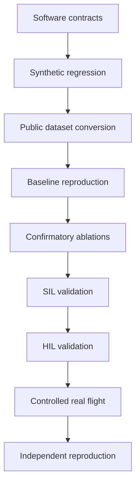

# Project status

S4D-TAM is under active research development. This page separates what is executable today from what still requires scientific implementation or validation.

## Current maturity

| Area | Status | What is available now |
| --- | --- | --- |
| Benchmark framework | Operational | normalized contracts, experiment runner, evaluators, reports and manifests |
| Synthetic validation | Operational | deterministic smoke benchmark used by CI |
| Python compatibility | Tested | automated tests on Python 3.10 and 3.12 |
| Dataset adapters | Partial | synthetic and manifest paths are usable; public dataset integration remains subject to conversion and verification work |
| External baselines | Interface ready | normalized artifact adapter and wrapper contract exist; full pinned baseline reproduction remains a validation milestone |
| S4D-TAM reference | Executable research reference | token lifecycle, association, attention-related components, forecasting, reference-map/topology support, telemetry and planning modules exist |
| Learned S4D-TAM model | In development | the current implementation is not the final trained hierarchical transformer described by the research concept |
| Scientific comparison | Protocol ready, evidence pending | metrics, preregistration, SIL/HIL/flight protocols and reporting infrastructure exist; confirmatory study is not yet complete |
| Flight readiness | Not validated | no flight certification or operational safety claim is made |

## Implemented S4D-TAM building blocks

The current source tree contains explicit modules for:

- token state and lifecycle management;
- token proposal and association;
- multimodal encoder interfaces;
- attention-related processing;
- calibration and uncertainty-related parameters;
- reference-map representation and topological matching;
- causal forecasting;
- predictive-map and trajectory-planning utilities;
- token event telemetry and audit logging.

These modules provide an executable and testable research reference. Their presence does not imply that every component is already learned, optimized, trained on the target datasets or validated at publication quality.

## What CI currently proves

The regular CI pipeline is intentionally scoped to software health during active development. It verifies:

- installation on supported Python versions;
- Python syntax;
- unit and regression tests;
- the synthetic smoke benchmark on `main`;
- documentation build consistency;
- CodeQL security analysis according to its own schedule and trigger rules.

Code-style findings from Ruff are currently advisory. They remain visible without being treated as evidence that the numerical benchmark is broken.

## What CI does not prove

A green workflow does not establish:

- correctness of public dataset conversions;
- equivalence to upstream baseline implementations;
- statistical superiority of S4D-TAM;
- generalization to unseen environments;
- real-time performance on embedded flight hardware;
- safety or airworthiness.

Those claims require the protocols described under **Evaluation protocols**.

## Research progression

For task-level progress, see the [Roadmap](roadmap.md). For the experimental rules that turn implementation results into scientific evidence, see [Methodology](methodology.md), [Preregistration](preregistration.md) and [Reproducibility](reproducibility.md).
